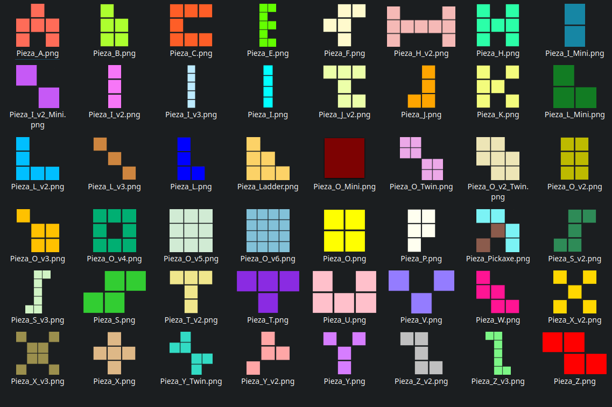
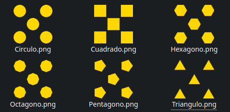
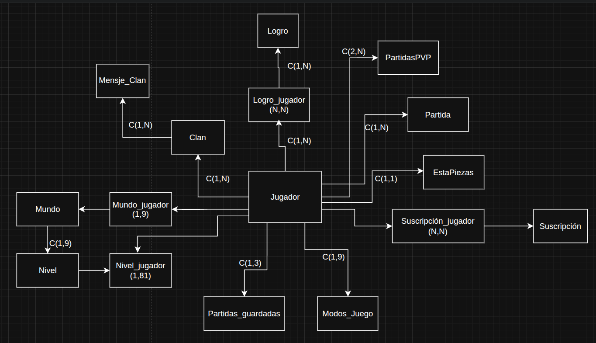
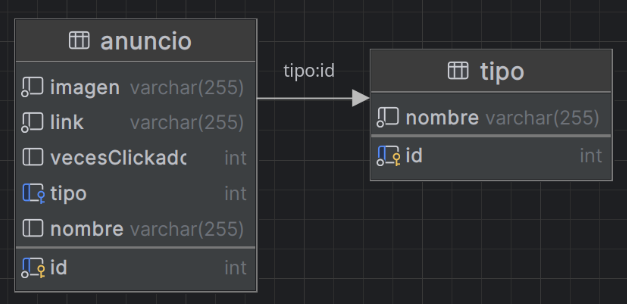

# 🧩 CustomBlocks

CustomBlocks es mi TFG del ciclo superior de Desarrollo de Aplicaciones Multiplataforma (DAM). Es un videojuego inspirado en Tetris, pero con muchas más características. Está desarrollado en Kotlin, pero usando el arcaico JavaFX, por lo que podría haber algunos problemas al ejecutar el proyecto. Además, aún debes montar los APIs y el servidor (enlaces más abajo), aunque podrás disfrutar del juego en su modo offline.

Si te interesa la lógica de las piezas, puedes encontrar todo el código relacionado en la carpeta `src/main/kotlin/com/pruden/tetris_2/Piezas`.

Me llena de orgullo poder decir que fue calificado con **Matrícula de Honor**. 

---

## 🎯 Características de CustomBlocks

- 48 Piezas distintas
- 15 posibles escenarios jugables
- Personalización completa de las partidas
- Mecánicas como dash lateral, sigiuentes piezas, hold...
- Modo campaña con 9 mundos y 81 niveles con teḿaticas de piezas y objetivos
- Modo online 1vs1
- Rankings de partidas y jugadores
- Sistema de logros y experiencia
- Estadísticas personalizadas
- Sistema de clanes y chat online
- Guardado de partidas
- Sistema de suscripciones
- Personalizar tanto piezas como tableros

---

## 🧠 Tecnologías Utilizadas

### 🖥️ Cliente

- **Lenguaje**: Kotlin
- **Interfaz**: JavaFX + CSS3
- **Dependencias**: Maven, Retrofit2, OkHttp3, Gson, WebSocket
- **Arquitectura**: Vista-Controlador con FXML
- **Serialización**: Gson

### 🌐 Servidor WebSocket (Realtime)

Disponible en: `https://github.com/PrudenK/ServerKtorChatClan`

- **Lenguaje**: Kotlin
- **Framework**: Ktor
- **Conexión**: WebSocket para chat y PVP

### 🔗 APIs

Disponibles en:
* Principal: `https://github.com/PrudenK/API_CustomBlocks`
* Anuncios: `https://github.com/PrudenK/API_anuncios`

- **Lenguaje**: PHP
- **Framework**: Symfony
- **BD**: MySQL
- **Contenerización**: Docker
- **Endpoints separados**: gestión de jugadores y anuncios
- **Gestión de sesiones**: Ping + Cron para usuarios inactivos

---

## 🎮 Componentes

### 🎲 Piezas

Aquí están todas las piezas jugables que tiene CustomBlocks:

  

Y aquí podemos ver los **diseños de las piezas**

  

Funcionamiento más detallado de las piezas en [Piezas.pdf](./asets/Piezas.pdf)

### 🧱 Tablero

Tanto el tablero como las piezas funcionan con matrices internas de números.
Para más información al respecto en [Tablero.pdf](./asets/Tablero.pdf)

### 💾 Base de datos

#### Principal

  

### Anuncios

  

